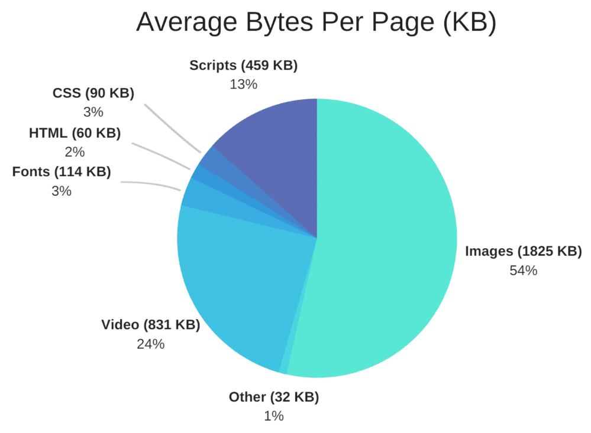

# Infinite-Image

[Click to view the live demo](https://jacobjanak.github.io/Infinite-Image/)

To use **Infinite Image**, you only need to include the script and stylesheet on your website, both of which are tiny and will not impact performance. The script relies on jQuery, so you must also include that.

# Purpose

**The Problem:**

Maintaing aspect ratio on images is hard. Telling an image to fill a dynamic element (an element that changes in size) will distort the image. But, if you're reading this right now, I probably don't have to tell you that.

Up until now, the solution has been to cut off the edges of the images as necessary. For example. on wide browsers, you would lose some of the top/bottom portions of the image.

There are two possible reasons you wouldn't want to do that:
1. You don't want to cut off any of the image
2. You want to support extremely wide monitors

**The Solution:**

Some images can be be duplicated, with the duplicate being flipped horizontally, to double the size of the image. This process can be repeated as many times as is necessary to cover the full width of the page.

For example, here is an image:

Now, let's double the width of the image:

This image is a simple pattern that doesn't need to be flipped horizontally. However, for most images, the flipping will be necessary to make it look like one, conguent picture. You *could* make an extremely wide image using this same technique in a photo editor, but that would come with a severe increase in load times.

**Infinite Image** leverages browser caching to efficiently increase the width of an image, and it only increases the width as much as is necessary for each particular browser.

# Performance

Developers must consider efficiency when dealing with images. **Infinite Image** does that for you. In this graph by [kinsta.com](https://www.kinsta.com), we can see that images are, by far, the largest files that websites have to load.

